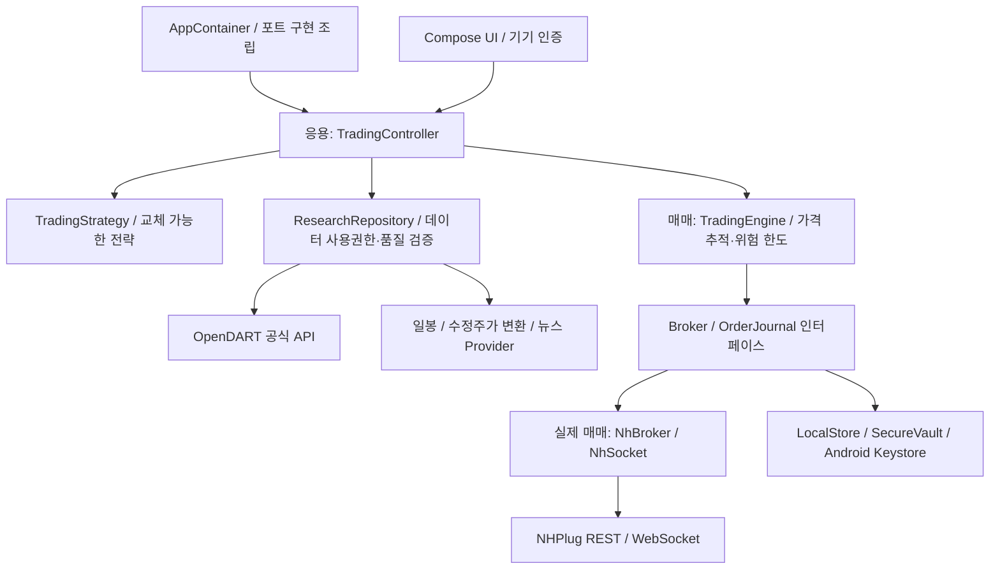

# StockNHPlug

Kotlin / Jetpack Compose 기반 NHPlug 국내주식 자동매매 앱입니다. 한국어 UI, 기기 내 암호화 저장, 모의투자 연결, 가격 추적·보유종목 관리, 주문·손익·로그 조회를 제공합니다.

**현재 버전은 출시 전 검증용입니다. 실거래는 잠겨 있습니다.** 물타기·리밸런싱 전략과 여러 그룹, 같은 종목의 그룹별 원장, 추천 조건 5개 조합, 전략/그룹 정기매수 설정을 제공합니다. **NHPlug 주문번호-체결번호의 공식 연결 검증 전 그룹 자동주문은 잠겨 있습니다.** 뉴스 이용계약과 수정주가 기준도 미확정이므로 신규 자동매수를 완료했다고 표시하지 않습니다. 구현 범위와 제약은 [그룹 전략 안내](docs/GROUP_STRATEGIES.md)를 참조하세요.

## 실행

1. JDK 17 이상, Android SDK 36을 설치합니다.
2. `local.properties`에 로컬 `sdk.dir`을 지정합니다. 이 파일은 커밋하지 않습니다.
3. `./gradlew testDebugUnitTest lintDebug assembleDebug` 실행. Windows에서는 `gradlew.bat`을 사용합니다.
4. APK: `app/build/outputs/apk/debug/app-debug.apk`.
5. 기기 PIN/패턴/비밀번호를 설정하고 앱에서 기기 인증을 완료합니다.
6. 설정에서 본인 NHPlug 앱키·secret, 선택적으로 본인 OpenDART 인증키를 입력합니다. 대화나 GitHub에 키를 보내지 마세요.
7. 전략 탭에서 물타기/리밸런싱 선택 → 그룹 추가 → 종목·예산·추천 조건·정기매수 설정을 저장합니다. 모의계좌 연결 후 리서치를 조회할 수 있으나 그룹 자동주문은 체결 대사 게이트 완료 전 실행되지 않습니다. 키 발급/모의투자 신청은 [NHPlug 공식 안내](https://www.nhplug.com/intro)를 따릅니다.

## 구성

## 계좌별 운용과 통계

[통계 화면 미리보기](docs/images/history-statistics.png) · [130% 글꼴](docs/images/history-statistics-130.png) — 합성 테스트 자료입니다.

설정에서 계좌 목록을 조회하고 각 계좌를 연결·설정한 뒤 자동운용 대상 계좌를 켭니다. 시작은 켠 계좌 전체, 화면 선택은 조회 대상만 바꿉니다. 자산 → 통계에서 일/월/연 손익과 일별 현금·거래 기록을 확인합니다. [계좌 격리·보존·계산 기준과 제한](docs/ACCOUNT_HISTORY.md). 기존 자동주문 검증 잠금은 유지합니다.

## 문서

- [손익 CSV/ZIP 다운로드·운용 점검](docs/EXPORT_AND_OPERATIONS.md) — 자산 → 통계에서 저장합니다. 선택 계좌/연도 범위만 포함하며 외부 파일은 암호화되지 않습니다. 홈에서 미확인 주문·자료 누락·일 매수 예약 한도를 점검합니다.

- [사용자 요청 원문 누적 기록](docs/USER_REQUESTS.md) — 새 요청은 실행 전에 원문으로 추가합니다.
- [진행 상태·압축 후 재개 지점](docs/WORK_STATUS.md)
- [테스트 APK 설치·키 설정·검증 범위](docs/TESTING.md)

- [물타기·리밸런싱·전략 그룹·정기매수](docs/GROUP_STRATEGIES.md)

- [API·데이터·전략 교체 안내](docs/EXTENDING.md)
- [계층 및 클래스 상세](docs/ARCHITECTURE.md)
- [진입점·함수 흐름도·코드 수정 안내](docs/CODE_FLOW.md)
- [데이터 출처·이용조건·보관 방침](docs/DATA_SOURCES.md)
- [전략·가격 추적·연구 근거](docs/STRATEGY.md)
- [보안 설계·위협 모델](docs/SECURITY.md)
- [UI와 사용자 흐름](docs/UX.md)
- [비동기 인터페이스·기능 블록 검토](docs/ASYNC_REVIEW.md)
- [Google Play 출시 게이트](docs/RELEASE.md)
- [개인정보 처리방침 초안](docs/PRIVACY.md)
- [검증 결과](docs/VERIFICATION.md)
- [개발 이력](docs/CHANGELOG.md)

NH투자증권 공식 앱이 아닙니다. 투자 수익·손절 실행·무결점·Google Play 승인을 보장하지 않습니다. 프로그램 정지는 이미 증권사에 접수된 주문을 취소하지 않습니다.

## 화면

Android 11 에뮬레이터의 UI 테스트 호스트에서 캡처한 연결 전 화면입니다. 실제 키나 계좌 데이터는 없습니다. 앱 본체는 화면 캡처를 차단합니다.

[자산 화면](docs/images/assets-modern.png) · [설정 화면](docs/images/settings-modern.png) · [130% 확대 화면](docs/images/assets-modern-130.png). 자산 화면은 UI 검증용 합성 계좌입니다.

파킹종목은 전략 화면의 `현금 관리`에서 설정합니다. [설정·매매 흐름·현재 제한](docs/PARKING.md)을 확인하세요. 실제 NH 자동주문은 기존 검증 게이트로 잠겨 있습니다.

### NamuMagic 가격 추적
사용자 저장소 기준으로 그룹별 반전 타겟, 10% 경계 WS/적응형 REST 전환, 트리거 후 파킹 자금 조정을 구현했습니다. [클래스·수식·차이와 한계](docs/PRICE_TRACKING.md). NH 실제 통합 검증 전 자동주문 시작 잠금은 유지됩니다.

사용 화면은 홈·전략·시세·자산·내역으로 구성합니다. 최우선 호가·스프레드, 보유 비중·수익률, 일별 종가 차트, 주문 필터를 제공합니다. [화면 체계와 사용성](docs/UX.md), [시세/주문 검증 결과](docs/VERIFICATION.md)를 확인하세요.

[손익 다운로드 화면](docs/images/history-export.png) · [운용 점검 화면](docs/images/operation-review.png) — 합성 테스트 자료.
