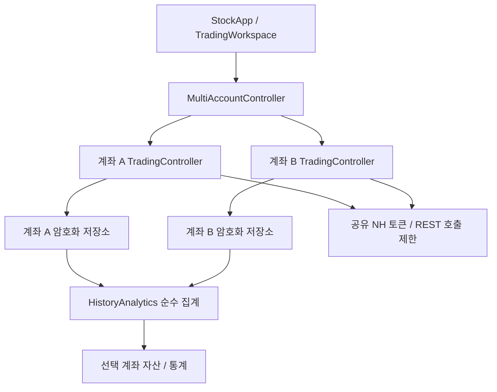

# 계좌 분리와 투자 통계

요청 25는 [USER_REQUESTS.md](USER_REQUESTS.md)에 실행 전에 보존했다. 시험 결과는 [VERIFICATION.md](VERIFICATION.md)에 기록한다.

## 소유권과 실행

`MultiAccountController`는 계좌 목록·enable·화면 선택과 전체 시작/정지만 소유한다. 각 계좌는 별도 `TradingController`, `TradingEngine`, `GroupTradingCoordinator`, `NamuExecutionGate`, `HybridPriceMonitor`, 소켓, 코루틴 scope, 암호화 저장소를 갖는다. 식별은 **증권사 ID + 환경 + 전체 계좌번호**다. 같은 전략/그룹 ID·종목·주문번호가 다른 계좌에 있어도 원장과 예산은 합치지 않는다. UI에는 마스킹과 계좌 순번을 표시한다.

화면 선택은 기존 계좌 작업을 취소하거나 새 계좌 API를 자동 조회하지 않는다. 각 계좌에서 연결/설정/분석한다. 설정의 `계좌별 운용`에서 여러 계좌를 켠 뒤 홈에서 시작한다. enable은 시작 명령과 별개이며 프로세스 재시작 후 자동 주문을 재개하지 않는다. 모든 신규 시작 대상의 공통 게이트를 먼저 검사해 미준비 계좌가 있으면 일부만 새로 시작하지 않는다. 실행 이후 한 계좌의 안전 정지는 다른 계좌 상태를 바꾸지 않는다. 전체 정지/서비스 종료는 모든 계좌, enable 해제는 해당 계좌만 정지한다.

`accountWorkspace(account)`는 화면 생성 시점의 계좌에 편집·조회 명령을 고정한다. 계좌를 바꾼 직후 이전 화면의 클릭/저장 콜백이 늦게 실행되어도 새 계좌를 수정하지 않는다. 공유 키/계좌 목록/전체 정지는 상위 관리자 명령을 사용한다.

현재 한 NHPlug 인증 세트가 반환하는 여러 계좌를 관리한다. **계좌마다 다른 앱키 등록은 포함하지 않는다.** 토큰과 `NhTransport` REST mutex/호출 간격을 공유해 계좌 수만큼 호출 제한을 우회하지 않는다. 소켓·연구 결과는 계좌별 세션에 속한다. 공유 키 변경·전체 삭제는 모든 계좌의 실행/요청 종료 후 가능하다. 키 변경 시 enable을 해제하고 기존 세션을 폐기한다. 계좌 목록 갱신은 정지 상태에서 수행하며 목록에서 사라진 계좌의 로컬 이력을 삭제하지 않는다. 재연결은 공식 목록에 현재 계좌가 있는지 검사한다.

NH 서버의 다중 소켓 한도·장중 실행은 별도 통합 검증 대상이다. 기존 그룹 체결 대사/연구/실거래 게이트를 우회하지 않는다. 구조 구현을 실제 자동주문 검증 완료로 표현하지 않는다.

## 저장과 이전

계좌 파일은 앱 `noBackupFilesDir/accounts/<SHA-256 식별값>` 아래 저장한다. 계좌번호를 파일명으로 쓰지 않는다. AES-GCM AAD에 계좌 namespace·파일명을 포함해 계좌 사이의 암호문 교체를 거절한다. 비추출 Keystore 키는 앱이 소유한다. 계좌 목록과 공유 인증 세트만 root vault, 주문·그룹 체결·전략·위험 한도·파킹·로그·보유/추적/일별 이력은 계좌 전용 vault에 있다.

`AccountMigration`은 기존 공용 기록 중 계좌를 식별할 수 있는 주문·보유·추적만 복사한다. 그룹 체결은 복사한 로컬 주문 ID에 속하는 기록만 가져온다. 미확인 주문 상태를 보존한다. 완료 표식을 마지막에 쓰며 원본은 삭제하지 않는다. 기존 기록이 있는 계좌에는 기존 전략·위험 설정을 독립 복사한다. 신규 계좌는 기본 설정이고 enable은 기본 OFF다. 계좌 식별이 없던 공용 로그를 특정 계좌에 복사하지 않는다. `기존 공용 전략 가져오기`는 선택 계좌에 전략·파킹만 명시적으로 복사한다. 위험 한도는 별도로 확인한다.

## 기록과 계산

`AccountDay`는 서울 날짜, 마지막 잔고(현금/총자산/평가손익/보유), 해당 날짜의 계좌 전체 누적 주문·체결, 증권사 일별 손익과 각각의 관측 시각을 가진다. 앱 주문만의 성과나 전략 손익이 아니다.

- 잔고·체결 전체 조회 후 같은 서울 날짜인지 검사한다. 도중 자정이 지나면 잘못 결합하지 않고 실패한다.
- 같은 날짜 재조회는 누적 체결을 교체한다. 계속 더하지 않는다. 날짜 안의 중복 주문번호를 거절하며 다른 날짜의 동일 번호는 별도다.
- 연결·수동 조회 시 최근 30일 보고 손익을 병합한다. 운용 중 잔고/거래는 기존 15초 루프, 손익은 15분 간격이다. OS·통신·API 지연을 포함한 수신 보장은 아니다.
- 새 손익 응답에 없는 날짜를 삭제하거나 0으로 채우지 않는다. 보존 이력을 365건으로 자르지 않는다. 미실행일의 과거 현금·체결을 소급 생성하지 않으며 최초 설치 전 전체 이력 가져오기는 아니다.
- 일/월/연 손익은 관측된 `DailyPnl.amount` 합계다. 매수 수수료·매도세금은 원천 항목을 따로 합산하며 손익에서 다시 빼지 않는다. 합계/수량×평균가는 BigDecimal이다.
- 이익일 비율 = 양수 관측일 / 손익 조회일 수. 보합 포함, 미조회 제외. 체결/전략 승률이 아니다.
- 거래대금은 누적 체결수량×평균체결가 합계다. 평균가 반올림 때문에 실제 정산금액과 차이 날 수 있다. 접수를 체결로 세지 않는다.
- 현금/총자산은 기간 내 마지막 관측 잔고이며 확정 종가 잔고가 아니다. 입출금/배당/결제 자료가 없어 자산 차액을 투자손익으로 계산하거나 시간가중 수익률을 만들지 않는다.

## 진입점과 화면

상단 계좌 칩은 화면 선택, 자동운용 스위치는 실행 대상, 홈 시작/전체 정지는 서비스 수명이다. 자산 → 통계에서 일/월/연·연도 필터·손익·현금·총자산·비용·이익일 비율·거래 기록을 확인한다. 관측일 수와 미조회 표시로 범위를 드러낸다. 기간 24개, 상세 14일, 거래 40개씩 더 보기로 부하를 제한한다.

## 다운로드

자산 → 통계에서 선택 계좌/연도 범위의 CSV 또는 ZIP을 저장한다. CSV는 현재 일/월/연 선택 단위, ZIP은 동일 범위의 모든 단위와 일별 현금/거래를 포함한다. 미조회/관측시각/누적 체결 의미는 화면과 같다. [파일 스키마·보안·클래스 흐름](EXPORT_AND_OPERATIONS.md).
