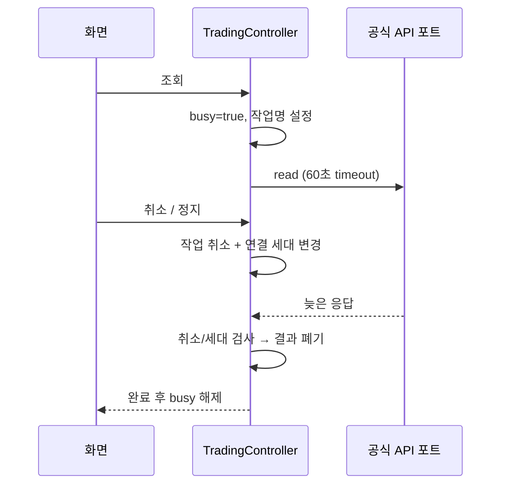

# 비동기 인터페이스와 기능 블록 검토

요청 25 확장: `MultiAccountController`의 화면 선택과 계좌별 `AccountRuntime`의 Job 수명을 분리했다. 계좌 A 응답/콜백은 A 상태만 갱신하고 선택 계좌 B 화면에는 들어가지 않는다. `accountWorkspace(account)`로 편집·조회 콜백을 생성 당시 계좌에 고정해 전환 직전의 지연 UI 이벤트도 새 계좌에 보내지 않는다. 전체 시작은 신규 대상의 validateStart를 모두 통과한 뒤 수행한다. 토큰/REST 호출 제한만 공유하고 전략/저널/파킹/시세/통계는 분리한다. 자세한 흐름은 [ACCOUNT_HISTORY.md](ACCOUNT_HISTORY.md).

요청 24의 원문은 [USER_REQUESTS.md](USER_REQUESTS.md)에 보존한다. 이 문서는 구현 계약이며 실제 시험 결과는 [VERIFICATION.md](VERIFICATION.md)에 구분한다.

## 요청 수명

`TradingController`가 Main dispatcher에서 상태를 직렬 변경한다. UI는 주문/저장/API 구현을 소유하지 않는다. `task(label)`은 coroutine을 시작하기 **전에** busy를 설정한다. 같은 프레임의 연속 탭이나 지연 dispatcher에서도 두 요청이 동시에 입장하지 않는다. 이름 있는 `operation`, 분석 `completedItems/totalItems`, 오류 여부를 화면에 노출하고 키/HTTP 본문은 노출하지 않는다.

`actionJob`의 완료 핸들러는 시작 전 취소까지 처리한다. 일반 finally만 사용하면 LAZY 작업의 본문에 들어가기 전 취소했을 때 로딩이 남을 수 있다. 완료 핸들러는 현재 작업과 identity가 같을 때만 상태를 해제하므로 이전 작업이 새 작업의 로딩을 지우지 않는다.

## 발견한 문제와 수정

| 경로 | 이전 문제 | 수정 |
|---|---|---|
| 연속 탭 | busy 설정이 launch 본문에 있어 dispatcher 변경 시 두 요청 가능 | 요청 진입 전에 busy 설정 |
| 정지 후 계좌/잔고 응답 | 별도 조회 작업이 남아 connected/잔고를 다시 표시할 수 있음 | actionJob 취소, read 완료 후 ensureActive + generation 검사 |
| 이전 연결 콜백 | factory 콜백이 현재 monitor를 참조 | connectionId 및 큐 적재 당시 generation 검사, 연결 전 WS 채택 차단 |
| monitor REST | clear 이후 응답으로 시세/극값 재생성 가능 | monitor 내부 generation + 취소 검사 |
| 조회 무한 대기 | 작업명이 없는 로딩만 지속 | 읽기 단계당 60초 timeout 및 작업명·분석 진행률·취소 제공 |
| 시작 전 취소 | finally 미실행 시 로딩 잔류 가능 | invokeOnCompletion으로 정리 |
| 자동운용 중 새로고침 | UI는 활성이나 controller가 요청을 무시 | UI 조회 버튼도 실행 중 비활성 |
| 그룹/파킹 저장 | 저장 요청 즉시 편집창 닫힘 | 실제 book/policy 반영 확인 후 닫힘, 실패 시 초안·오류 유지 |
| 일부 조회 성공 | 기존 일괄 게시 보장이 유지되는지 검토 | 전체 조회 성공 후 화면/스냅샷을 교체하는 기존 동작 유지, 늦은 응답 차단 추가. 실패 시 이전 시각의 잔고 유지 회귀 검증 |
| 손익 | 미조회와 정상 빈 응답 혼동, 입력 순서 의존 | pnlLoadedAt, 날짜 중복 거부/정렬, 기간 합계 BigDecimal |
| 키 교체 | 이전 계좌의 손익 조회 완료 시각이 남을 수 있음 | 계좌 데이터와 pnlLoadedAt 함께 초기화 |
| 계좌별 이력 | 다른 계좌 데이터만 있으면 빈 상태 안내 누락 | 계좌 필터 후 빈 결과 판단 |

취소는 증권사 주문 취소가 아니다. 조회 취소는 연결을 종료하고 재연결 안내를 표시한다. 취소를 무시하는 제공자는 반환 시점까지 남아 있을 수 있으나 늦은 결과는 반영하지 않는다. 진행 중 작업이 완료되기 전 전체 데이터 삭제/다음 요청은 차단한다. 백그라운드 계좌 조회 timeout은 자동매매를 안전 정지시킨다. 주문 자체에 새 timeout/재시도 정책을 적용하지 않았다.

## 기능 블록의 데이터 의미

| 화면 | 기능 | 논리 기준 |
|---|---|---|
| 홈 | 총자산·예수금·평가손익·운용 준비 | 계좌 응답/조회 시각 표시. 미조회는 0원으로 바꾸지 않음. 한 종목 근거만으로 전체 준비 완료 표시하지 않음 |
| 전략 | 전략·그룹·추천·일정·현금 관리 | 기존 소유권/예산/연구 게이트 유지. 저장 성공 후 반영 |
| 시세 | 최우선 매수/매도 호가·스프레드 | 기존 공식 currentPrice/WS의 bid/ask만 사용. 스프레드 비율은 중간호가 기준. 잔량·다단계 호가·체결강도는 추정하지 않음 |
| 시세/분석 | 일별 종가 차트 | 조회된 최근 60개 양수·유한 종가만 표시. 수정주가 여부 명시. 미래 수익률/자동 추천 승인으로 표현하지 않음 |
| 자산/잔고 | 평가액·평가수익률·보유 비중·정렬 | 평가액=수량×잔고 가격, 수익률=증권사 보고 손익÷매입원가, 비중=해당 주식 평가액÷보유주식 평가액 합계. 예수금 제외. 원가/분모 0이면 미제공 |
| 내역/주문 | 상태 필터·종목 검색·계좌 범위 | 접수와 체결을 구분. 확인 필요=UNKNOWN/SUBMITTING. 자동 재전송 없음 |
| 내역/체결 | 미체결 포함 필터 | 실제 계좌 응답의 remaining>0만 필터링. 앱 주문 접수로 체결 수량을 추정하지 않음 |

모든 금융 금액 곱셈/새 합계는 BigDecimal로 계산해 Long 곱셈 오버플로를 피한다. UI 파생 지표는 주문 엔진에 전달하지 않는다. 대량 주문/체결/보유 이력은 40개 단위로 표시한다.

자산 화면에 잔고 기준 시각을 표시한다. 동기화 실패 시 보존한 이전 잔고를 실시간 잔고로 오인하지 않게 한다. 화면 갱신은 API 응답 도착을 보장하지 않으며 실제 장시간 백그라운드/Doze 시험은 별도 출시 게이트다.

## 참고

- [Kotlin coroutine 취소](https://kotlinlang.org/docs/cancellation-and-timeouts.html): 취소는 협력적이므로 완료 후 검사와 콜백 세대 검사를 함께 적용한다.
- [Compose 기본 접근성](https://developer.android.com/develop/ui/compose/accessibility/api-defaults): Material 버튼/탭의 기본 semantics와 터치 영역을 사용하며 차트에 대체 설명을 추가한다.

## 요청 26: 파일 선택과 계좌 변경

선택 순간 HistoryExport.capture가 복사한 자료만 export ViewModel에 전달한다. 선택기를 열어 MainActivity.onStop으로 잠겨도 ActivityResult 등록은 유지된다. 회전은 ViewModel을 유지하고, 프로세스 사망은 요청을 만료시킨다. 저장 IO는 viewModelScope에서 수행하며 행/항목별 취소 검사, close 성공 후 완료, 실패 시 일반화된 메시지를 적용한다. 전체 이력을 Bundle/임시 평문 파일로 복원하지 않는다. busy는 선택기 실행 전 동기 설정한다. 앱 저장과 매매 작업의 잡/스코프를 공유하지 않는다. 외부 제공자가 블로킹 I/O에서 응답하지 않으면 시간/원자성을 보장할 수 없으며 불완전 문서가 남을 수 있다. [상세](EXPORT_AND_OPERATIONS.md).
