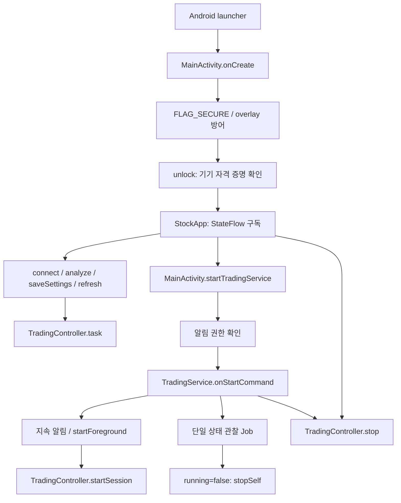
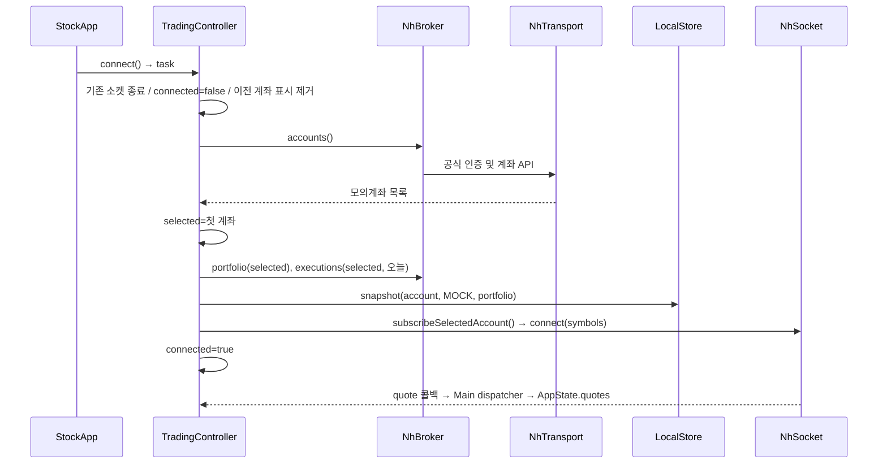
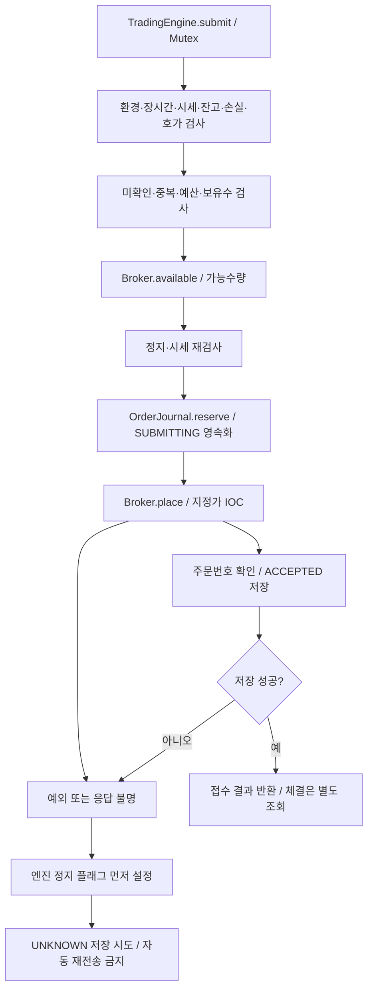

# 진입점·함수 호출 흐름과 수정 안내

기준일: 2026-09-19. 실제 구현의 호출 순서를 설명합니다. 전체 클래스 책임은 [ARCHITECTURE.md](ARCHITECTURE.md), 검증 근거는 [VERIFICATION.md](VERIFICATION.md)를 함께 읽으세요.

## 처음 읽는 순서

1. `AndroidManifest.xml`에서 launcher `MainActivity`와 외부에 공개하지 않는 `TradingService`를 확인합니다.
2. `MainActivity.onCreate` → `unlock` → `StockApp`으로 인증과 화면 진입을 읽습니다.
3. `TradingController`의 `connect`, `analyze`, `startSession`, `stop`으로 사용자 액션과 작업 수명을 읽습니다.
4. `TradingEngine.submit`에서 주문 안전 조건과 사전 기록을 확인합니다.
5. `NhBroker` → `NhTransport`, `LocalStore` → `SecureVault`로 실제 부작용을 따라갑니다.

코드의 KDoc은 호출 주체, 입력의 의미, 반환값의 한계, 실패 시 처리 이유를 설명합니다. 단순 표시용 Compose 함수는 화면 역할을 주석에 적고 주문 규칙은 엔진에 유지합니다.

## 화면과 서비스 진입점

`MainActivity.onStop`은 UI를 다시 잠급니다. Activity가 멈춰도 사용자가 시작한 서비스 세션은 유지될 수 있습니다. 서비스 정지 알림, `onTaskRemoved`, `onDestroy`는 컨트롤러 정지를 호출합니다. `START_NOT_STICKY`로 OS가 프로세스를 복구해 자동 주문하는 경로는 없습니다. 화면 인증 성공은 실제 기기의 별도 검증 대상입니다.

`TradingController.get`은 applicationContext로 프로세스 단일 객체를 만듭니다. 초기화 시 암호화된 설정·주문·이벤트·스냅샷을 읽지만 키는 `AppState`에 넣지 않습니다. 저장소 읽기 실패는 `storageError`로 잠그며 빈 정상 저널로 대체하지 않습니다.

## 계좌 연결과 전환

`connected`는 초기 조회와 소켓 연결 요청 완료를 뜻합니다. WebSocket 구독 승인이나 새 시세 수신을 보증하지 않으며, 주문 시 `Quote.fresh`를 다시 검사합니다. `select`도 이전 가격·손익을 지우고 잔고 조회 및 구독을 다시 수행합니다. 보유종목과 관심종목 합집합이 10개를 넘으면 연결을 실패로 처리해 일부 보유종목이 관리에서 조용히 빠지는 일을 막습니다.

`saveCredentials`는 기존 토큰·브로커·엔진·계좌·분석 결과를 무효화합니다. `saveSettings`는 입력 검증/저장 후 구독을 닫으며 다시 연결해야 합니다. 키 교체나 계좌 전환은 실행 중 허용하지 않습니다.

## 리서치와 매수 판단

`analyze` → 종목코드/기업고유번호 형식 검사 → `ResearchRepository.inspect` → `NhBroker.candles`, `DartClient.financials/disclosures`, `NewsProvider` → `ResearchEvidence`를 구성합니다. `SignalEngine.evaluate`는 완료 봉으로 지표와 점수를 계산합니다. UI의 점수가 높아도 `buyBlockers`가 비어 있지 않으면 매수할 수 없습니다.

현재 일봉은 수정주가 보장이 없고 뉴스 이용권한도 미확정입니다. 이 두 조건은 의도적으로 신규 자동매수를 차단합니다. 테스트 데이터를 운영 근거로 채우거나 `adjusted`/`newsLicensed`만 바꾸어 활성화하면 안 됩니다. 새 공급자는 출처 계약, 공개시각, 기업 매핑, 수정계수 검증을 포함해 문서와 테스트를 함께 수정해야 합니다.

## 자동매매 반복과 주문 상태

`startSession`은 연결·작업 상태·저장소·보유관리 동의 또는 매수 근거·미확인 주문을 검사합니다. `TradingEngine.start`가 세션 기준 순자산과 추적 고점을 초기화하며 실행 중 재호출은 거절합니다. 이후 최대 6시간 동안 잔고/체결 조회 → 보유종목 청산 평가 → 추천 매수 평가 → 15초 대기 순서로 동작합니다.

`SUBMITTING` 저장 실패면 네트워크 주문을 보내지 않습니다. 주문 전송 이후 상태 저장까지 실패해도 엔진은 먼저 정지합니다. 디스크에 `SUBMITTING`이 남으면 재시작 시에도 미확인 주문으로 취급합니다. 앱 UUID는 증권사의 중복 방지 키가 아닙니다. `ACCEPTED`는 체결이 아니며 `Execution.filled`로 구분합니다.

`stop`은 엔진을 정지하고 loop를 취소합니다. 종료 중에는 `busy`를 유지해 삭제/재시작과 경쟁하지 않게 합니다. 이미 전송한 요청은 취소되었더라도 서버가 접수했을 수 있으므로 증권사 내역 확인이 필요합니다. 프로세스 재실행도 저널의 미확인 상태를 우회하지 않습니다.

## 실행 스레드와 저장 책임

| 경계 | 실행 위치 및 책임 |
|---|---|
| Compose 액션, 컨트롤러 상태 변경 | Main dispatcher. `task`가 중복 액션을 막으며 자동매매 중 수동 조회/설정 액션은 받지 않음 |
| 15초 매매 loop | Main scope의 suspend 작업. 네트워크는 전송기 내부 IO로 전환 |
| OkHttp WebSocket 콜백 | 컨트롤러가 `scope.launch`로 Main에 전달. 소켓 generation으로 닫힌 연결의 콜백을 배제 |
| REST 요청 | `NhTransport`의 IO 및 호출 간격 Mutex. 리다이렉트/연결 자동 재시도 없음 |
| 주문 직렬화 | `TradingEngine`의 Mutex. 단일 주문 저널 예약과 전송 순서를 유지 |
| 파일 암호화/기록 | `SecureVault` 동기 AtomicFile. 일부 로그/저널은 Main 호출 경로이므로 저속 저장장치 성능 검증 필요 |
| 장기 작업 종료 | loop 취소 및 서비스 scope 취소. 자동 재시작 없음 |

## 수정 위치와 필요한 검증

| 바꾸려는 기능 | 먼저 볼 클래스/함수 | 함께 확인할 테스트·문서 |
|---|---|---|
| 화면/탭/문구 | `StockApp`, 각 화면 Composable | `UiInstrumentedTest`, UX |
| 인증/다른 앱과의 보안 | `MainActivity`, `SecureVault` | `VaultInstrumentedTest`, SECURITY, 실제 기기 검사 |
| 세션 수명/계좌 전환 | `TradingController`, `TradingService` | ARCHITECTURE, 서비스/계좌 통합 검증 |
| 손절·익절·예산 | `TradingEngine.exitReason/submit`, `Strategy.validate` | `TradingEngineTest`, STRATEGY |
| 지표/추천 점수 | `SignalEngine.evaluate/rsi/atr` | `ResearchTest`, STRATEGY |
| 데이터 공급자 | `ResearchRepository`, `DartClient`, `NewsProvider` | DATA_SOURCES, ResearchTest, 이용계약 근거 |
| NH API 필드/응답 | `NhBroker`, `NhTransport`, `NhSocket` | ProtocolTest, 공식 명세, 모의계좌 검증 |
| 저장 포맷 | `LocalStore`, `SecureVault` | 이전 데이터 호환성/변조 테스트, SECURITY |

의미 있는 변경 뒤 `./gradlew testDebugUnitTest lintDebug assembleDebug`와 `./gradlew bundleRelease`를 실행합니다. 기기 테스트는 폐기 가능한 설치에서만 수행합니다. 검증하지 못한 조건도 VERIFICATION에 적고 모든 정책/구현 변경은 CHANGELOG에 남깁니다.
