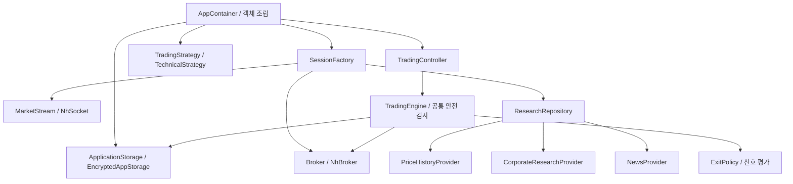

# API·데이터·전략 교체 안내

기준일: 2026-09-19. 현재 구현은 NHPlug 모의 API와 `TechnicalStrategy` 한 종류를 조립합니다. 다른 증권사의 실제 어댑터나 전략 선택 UI를 제공한다는 뜻은 아닙니다. 아래 포트를 구현하고 `AppContainer`의 조립을 바꾸면 응용/안전 엔진을 유지하면서 교체할 수 있습니다. 원격 플러그인 다운로드나 실행 중 교체는 허용하지 않습니다.

## 교체 단위

| 교체 대상 | 구현 계약 | 현재 구현 | 유지되는 공통 책임 |
|---|---|---|---|
| 증권사 계좌·주문·체결·손익 | `Broker` | `NhBroker` | 주문 직렬화, 사전 저널, 중복/위험 한도 |
| 실시간 시세 | `MarketStream` | `NhSocket` | 연결 단절 정지, 가격 신선도 검사 |
| 일별 가격이력 | `PriceHistoryProvider` | `NhPriceHistoryProvider` | 종목 일치, 출처/수정 여부 보존, 매수 근거 검사 |
| 기업 재무·공시 | `CorporateResearchProvider` | `DartClient` | 누락 근거 차단, 위험 공시 검사 |
| 뉴스 | `NewsProvider` | `UnlicensedNewsProvider` | 이용권한 확인 전 매수 차단 |
| 추천·매수 규모·청산 신호 | `TradingStrategy` / `ExitPolicy` | `TechnicalStrategy` / `ThresholdExitPolicy` | 사용자 예산 상한, 가능수량, 손실 한도, 데이터 권한 |
| 로컬 영속 저장 | `ApplicationStorage` | `EncryptedAppStorage` | 사전 저장 실패 시 주문 금지, 키 읽기 비노출 |

## 의존성 조립

`AppContainer.get(context).controller`가 화면과 서비스의 공통 진입점입니다. 컨테이너만 Android 저장소와 NH/DART 구현을 알고 있으며 다음 순서로 조립합니다.

`SessionFactory.create`는 `BrokerSession(broker, stream, research)`를 반환합니다. 연결 콜백은 컨트롤러가 Main dispatcher로 전달합니다. `NhTransport`는 `infrastructure/nh`의 공유 전송 구현이며 실행·가격이력 어댑터가 사용합니다. 연구 정책과 전략은 HTTP/JSON/토큰을 모르며 주문 `Broker`를 연구 데이터 조회에 사용하지 않습니다.

## 다른 증권 API를 추가할 때

1. 공식 계약과 인증/모의 환경/주문·체결 의미를 검토하고 DATA_SOURCES 및 RELEASE에 근거를 기록합니다.
2. 안정적인 `Broker.id`를 정합니다. 계좌는 `Account(number, environment, brokerId)`로 정규화하고 해당 증권사의 계좌 타입 코드는 어댑터 내부에서만 해석합니다.
3. `Broker`의 조회/가능수량/주문/체결/손익을 구현합니다. `place`는 접수번호만 반환하며 체결 성공을 뜻하지 않습니다. 타임아웃을 자동 재시도하지 않습니다. 현재 주문 모델은 국내 주식 원화 정수 가격·수량·지정가 IOC 기준입니다. 해당 의미를 지원하지 않는 API를 임의 변환해 연결하지 않습니다.
4. `MarketStream`은 유효한 거래소 시각/수신 시각을 포함한 `Quote`를 전달해야 합니다. 연결 오류는 `onDisconnect`를 통지하고 닫힌 연결의 콜백은 배제합니다.
5. `AppContainer`의 `SessionFactory`에서 구현체를 교체합니다. API별 키는 발급자의 공식 인증에만 전송하고 일반 백엔드로 옮기지 않습니다. 현재 저장 UI는 한 연결의 키를 관리하므로 다중 증권사 동시 연결 UI/키 이름공간은 추가 구현 대상입니다.
6. 잘못된 계좌/증권사, 중복 접수, 통신 지연, 페이지 누락, 체결 구분, 운영/모의 혼용을 테스트합니다. 실거래 게이트가 닫혀 있으면 새 구현도 운영 계좌를 활성화할 수 없습니다.

주문/보유 기록에는 `brokerId`를 함께 저장합니다. 같은 계좌번호라도 증권사가 다르면 별개로 조회·중복 판정합니다. 기존 파일에 이 필드가 없으면 초기 NHPlug 전용 버전의 기록으로 해석해 `nhplug`를 적용합니다. 손상된 JSON을 신규 빈 이력으로 바꾸는 마이그레이션은 금지합니다.

## 다른 전략을 추가할 때

`TradingStrategy`의 `evaluate`, `orderBudget`, `exitReason`, `id`를 구현하고 `AppContainer`에서 `TechnicalStrategy()` 자리에 주입합니다.

- `evaluate`: 받은 완료 봉으로 `Candidate?`를 반환합니다. `null`은 후보 없음이며 주문 요청이 아닙니다.
- `orderBudget`: 후보별 희망 예산을 반환합니다. 10,000원 미만은 보류하고 사용자 주문 예산보다 큰 값은 컨트롤러에서 제한합니다. 일 예산/현금 가능수량은 엔진에서 다시 검사합니다.
- `exitReason`: 같은 종목의 유효한 정규장 가격과 엔진의 세션 고점을 받아 청산 이유 또는 null을 반환합니다. 보유관리 동의/장시간/손실/중복/저널 검사를 건너뛰지 않습니다.
- `id`: 코드에서 구현을 구분하는 안정적인 식별자입니다. 현재 전략별 성과 집계나 다중 전략 동시 실행은 구현하지 않았습니다.

전략에는 Broker/저장소/Android Context를 주입하지 않습니다. 새 전략이 직접 주문하게 만드는 것은 교체 계약 위반입니다. 세션 중 전략 변경은 금지하며, 앱을 재빌드하여 정지된 세션에서 새 조합을 시작합니다. 전략을 바꿔도 미확인 주문과 당일 중복 방지 기록은 유지됩니다.

## 경계 검사와 테스트

`python scripts/check_architecture.py`를 CI에서 실행합니다. domain/trading의 어댑터 역참조, 응용 계층의 Android/HTTP/저장 구현 의존, 연구 정책의 제공자 직접 생성, UI의 보안 저장소 접근을 소스 의존성 기준으로 검사합니다. 현재는 단일 Android Gradle 모듈 내 패키지 분리이며 Kotlin 컴파일러 수준의 다중 모듈 격리는 아닙니다.

`ResearchRepositoryTest`는 가격 공급자 교체와 오류/종목 불일치를 검사합니다. `TradingEngineTest`는 교체한 청산 정책에도 동의·시세 검사가 유지되는지, 다른 증권사의 주문이 섞이지 않는지 검사합니다. LocalStore 기기 테스트는 증권사/계좌/환경별 스냅샷 분리를 확인합니다. 실제 새 API는 이 테스트만으로 인증되지 않으며 해당 증권사의 모의계좌 검증이 필요합니다.

## 그룹 전략 확장

현재 기본 자동매매 실행은 TradingStrategy 단일 알고리즘 대신 GroupAlgorithm을 사용합니다. 새 GroupAlgorithm 구현을 AppContainer의 GroupAlgorithmRegistry에 등록하면 전략 추가 UI에 표시됩니다. GroupContext는 해당 그룹의 확정 수량/원가/현금과 유효 시세만 제공하며, GroupDecision은 희망 주문입니다. 실제 전송은 GroupTradingCoordinator와 TradingEngine의 공통 위험/저널 검사를 거칩니다. 필요한 고유 설정은 StrategyGroup/GroupCodec/편집 UI와 테스트를 함께 확장합니다. BrokerSession에 GroupExecutionSource를 제공하지 않은 API는 그룹 자동주문을 할 수 없습니다. 상세 계약은 [GROUP_STRATEGIES.md](GROUP_STRATEGIES.md)를 참조합니다.

## 파킹 확장
`ParkingPlanner`는 Android/증권사 의존성 없는 순수 현금 정책입니다. 상품별 데이터 적격성, 결제일 모델, 다른 가격 추적을 추가하더라도 공통 엔진·체결 종료 대사·최소 현금·주문 회전 한도를 우회하지 마세요. 새 상품의 데이터 조건을 단순히 생략해서는 안 됩니다.

## 가격 추적 교체
`ExecutionGate`를 AppContainer에서 주입해 추적 전략을 교체합니다. `CurrentPriceProvider`와 `MarketStream`은 BrokerSession에서 별도 교체합니다. 어댑터는 거래소 시각·호가·당일 상하한·상품 종류·구독 ACK를 제공해야 합니다. 공통 TradingEngine/저널/연구 게이트는 교체 대상이 아닙니다.

교체 시세 어댑터도 PriceSnapshot.valid의 양방향 호가/당일 가격범위 검사를 통과해야 합니다. 시세 수신시각이 증가해도 거래소 시각이 후퇴한 샘플은 상태 갱신에 쓰지 않습니다. UI Workspace는 AppState와 이벤트 콜백으로 테스트하며 구체 Broker를 참조하지 않습니다.

새 Broker도 OrderIntent.dispatchable을 실제 네트워크 전송 직전에 검사해야 합니다. expiresAt을 현재 시각 기준으로 다시 계산하거나 연장하지 마세요. 이는 교체 가능한 실행 포트의 계약입니다.
