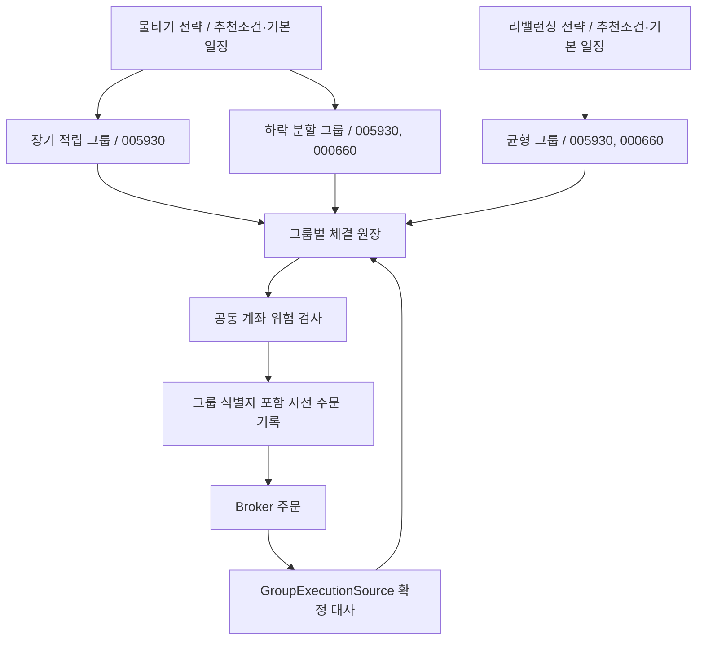

# 물타기·리밸런싱 전략 그룹

기준일: 2026-09-19. 이 문서는 기본 전략, 그룹 소유권, 추천 조건, 정기매수와 실제 구현 한계를 설명합니다.

## 현재 동작 범위

전략/그룹 생성·편집·켜기/끄기, 전략별 추천 조건, 5개 지표 조합, 전략/그룹 정기매수 설정, 암호화 저장, 그룹 원장·전략 판단·주문 라우팅과 테스트를 구현했습니다. 초기에는 물타기와 리밸런싱 전략이 각각 하나씩 있고 그룹은 비어 있으며 모두 꺼져 있습니다. 다른 전략 인스턴스를 추가하거나 기존 알고리즘을 여러 전략에 사용할 수 있습니다.

**현재 NHPlug 어댑터의 그룹 자동주문은 잠겨 있습니다.** 공개 주문 응답은 `mkt_orr_no`(시장주문번호), 일별 체결 조회는 `itg_orr_no`(통합주문번호)를 제공합니다. 두 번호를 연결하는 공식 근거를 확보하지 못했습니다. 시간·종목·수량이 비슷하다는 이유로 체결을 연결하면 동일 종목을 여러 그룹에서 매매할 때 소유권이 뒤섞일 수 있습니다. 이를 추측하지 않고 `BrokerSession.groupExecutions=null`로 두었습니다. 화면과 시작점 모두 잠금을 표시/적용합니다. 실제 주문을 가능하게 하려면 공식 대응 명세와 모의계좌 검증을 바탕으로 `GroupExecutionSource`를 구현해야 합니다. 단순히 플래그를 켜서는 안 됩니다.

뉴스 권한과 수정주가 미검증에 따른 신규매수 차단도 유지합니다. 정기매수/물타기/리밸런싱 매수 역시 필수 자료 게이트를 우회하지 않습니다. 따라서 설정 저장 성공이나 단위 테스트 통과가 NHPlug 자동매매 운영 준비 완료를 의미하지 않습니다.

## 전략 → 그룹 → 종목

- `StrategyPlan.id`: 사용자 전략 인스턴스 식별자. 이름과 별개입니다.
- `algorithmId`: 물타기 `averaging`, 리밸런싱 `rebalance` 등 구현 선택 키입니다.
- `StrategyGroup.id`: 수량·원가·실현손익·중복 주문 판단의 소유권 식별자입니다.
- 주문에는 증권사/계좌/환경/전략/그룹/정기매수 회차를 함께 기록합니다.
- 같은 종목은 여러 전략·그룹에 넣을 수 있지만 한 그룹 안에서는 중복할 수 없습니다.
- 전략 최대 20개, 그룹 최대 100개, 그룹당 종목 최대 10개입니다. 현재 NHPlug 실시간 연결은 **구독 합집합 10종목 한도**를 그대로 적용합니다. 동일 종목은 한 번만 구독합니다. 설정 그룹 수와 동시에 연결 가능한 고유 종목 수는 다릅니다.
- 앱 외부에서 산 계좌 보유량은 어느 그룹에도 자동 배정하지 않습니다. 기존 기록은 그룹 미지정 상태로 유지합니다.
- 기록이 있는 그룹은 삭제·다른 전략으로 이동·기존 종목 제거를 금지하며 끄기로 보관합니다. 이름/허용된 조건은 정지 상태에서 편집할 수 있습니다.

## 그룹 자금과 소유권

그룹 자본은 실제 별도 증권계좌가 아닌 앱 내부 배정 한도입니다. 그룹 현금 = 배정 자본 − 체결 매수대금/비용 + 체결 매도대금 − 매도비용으로 계산합니다. 그룹 원가는 매수 체결의 금액/비용을 누적하고 매도 시 평균 원가에 비례해 감소시킵니다. 원 단위 나눗셈의 잔액은 남은 원가에 유지합니다. 실현손익은 매도 순수입에서 배분 원가를 뺀 값입니다.

`GroupFillReport`는 로컬 주문 ID에 대응된 누적 수량·누적 체결금액·누적 수수료/세금·종료 여부·확인 시각입니다. `GroupLedger.merge`는 수량/금액 후퇴·알 수 없는 주문·최종 체결 변경을 거절합니다. 같은 누적 보고를 반복해도 보유량을 중복 증가시키지 않습니다. 부분체결과 최종 종료는 별개이며 해당 계좌의 그룹 주문이 미종료이면 다음 그룹 주문을 보내지 않습니다. 이는 처리량보다 소유권 보존을 우선한 제한입니다.

그룹 매도는 그룹의 확정 보유량, 계좌 보유량, 증권사 현금 매도 가능수량, 공통 주문 상한 중 허용된 수량으로 제한합니다. 계좌에서 외부 매도가 발생해 그룹 원장 합계가 실제 보유량보다 크면 거래를 정지합니다. 분할·합병·권리·체결 정정·수수료 사후 변경은 별도 대사 구현/실계좌 검증 대상입니다.

## 기본 전략

### 물타기

신규 진입은 추천매수 조건 또는 정기매수로 이루어집니다. 그룹 확정 평균 원가보다 설정 하락률 이상 낮은 매도호가에서 추가매수를 제안합니다. 기본 하락률 3%, 최대 추가매수 3회입니다. 최초 매수 1회 이후 최대 추가 횟수를 검사하고 미확인 주문 중에는 추가하지 않습니다. 매수 횟수는 해당 그룹/종목의 양수 체결 주문 수 기준이며 정기매수도 포함됩니다. 현재 매수 횟수는 기록 전체 기준으로, 전량 매도 후 자동 초기화하지 않습니다.

기본 목표 수익률 6%에서 그룹 보유 주식의 매도를 제안합니다. 수익률은 수수료가 반영된 평균 원가 기준의 호가 비교이며 최종 매도 수수료/세금까지 포함한 확정 수익률이 아닙니다. 목표 수익률과 주문 예산은 그룹에서 수정합니다. 손실 한도는 별도의 계좌 공통 세션 위험 검사로 유지합니다.

### 리밸런싱

그룹 순자산 = 그룹 현금 + 그룹별 확정 수량 × 유효 현재가입니다. 종목별 현재 비중과 설정 목표 비중의 차이가 허용 오차를 넘으면 목표 금액 쪽으로 매수/매도를 제안합니다. 기본 허용 오차는 5%p입니다. 목표 비중 합계는 100% 이하이며 나머지는 현금으로 남깁니다.

매도 제안을 먼저 처리하며, 매도 접수 금액을 즉시 새 매수 자금으로 간주하지 않습니다. 체결 대사 후 다음 회차에서 다시 평가합니다. 아직 보유하지 않은 종목의 리밸런싱 신규매수는 전략 추천매수 on/off와 조건을 통과해야 하며, 명시적 정기매수 설정은 별도 진입 경로입니다. 모든 매수의 필수 데이터 게이트는 동일합니다.

## 추천매수 조건

전략마다 켜기/끄기와 개별 지표 토글·조건값을 저장합니다. 활성 지표는 AND로 평가하며 추천매수를 켜려면 적어도 하나의 지표가 활성화되어야 합니다. 그룹에 직접 등록한 종목이 후보 범위이며 전체 시장 자동 스캔 기능은 아닙니다.

| 지표 | 조건 |
|---|---|
| 이동평균 추세 | 현재 완료 종가 > 단기 평균 > 장기 평균; 기본 20/60일, 일수 수정 가능 |
| RSI14 | 최소~최대 범위 |
| 20일 모멘텀 | 최소 상승률 % |
| 거래량 | 직전 20일 평균 대비 최소 배수 |
| ATR14 | 종가 대비 최대 % |
| 영업이익률 | OpenDART 자료의 최소 % |
| 부채비율 | OpenDART 자료의 최대 % |

선택 가능한 조합은 **추세·모멘텀 / 눌림목 / 거래량 확장 / 저변동 추세 / 재무·추세**의 5가지입니다. 설정 시작점이며 수익 검증·종목 추천을 의미하지 않습니다. 조합을 선택해도 추천매수 on/off 상태는 바뀌지 않습니다. 필수 수정주가·재무·공시·뉴스 권리/신선도 검사는 사용자 지표 토글로 해제할 수 없습니다. 당일 미완성 봉을 제외하고 부족/중복/유효하지 않은 가격 자료를 거절합니다.

## 전략·그룹 정기매수

전략 기본 일정은 각 하위 그룹에 적용하며 **금액은 그룹마다 적용되는 회차 예산**입니다. 그룹은 `INHERIT`(따르기), `OFF`(끄기), `CUSTOM`(별도 설정)을 선택합니다. 별도 설정에서는 사용 토글을 추가로 켜야 합니다.

- 주기: 매 평일 / 매주 월~금 / 매월 1~31일.
- 시간: 서울 기준 09:05~14:59 입력, 해당 날짜 설정 시간 이후 15:15 전까지 평가.
- 매월 존재하지 않는 날짜는 월말로 맞추고 주말은 다음 평일로 이동합니다. 다음 달로 넘어가더라도 원래 월 회차 ID를 유지합니다.
- 공휴일 달력은 미구현입니다. 정규장 실시간 가격이 없으면 주문하지 않고 다음 거래일로 자동 소급하지 않습니다.
- 앱의 사용자가 시작한 최대 6시간 foreground 세션 안에서만 평가합니다. 알람/부팅 자동 실행/앱 종료 상태의 실행 보장은 없습니다.
- 정기예산을 종목별 설정 비중으로 나누며 남는 현금은 유지합니다. 종목당 그룹 주문 한도와 계좌 전체 한도를 다시 적용합니다.
- 같은 그룹·종목·방향은 하루 한 번만 주문합니다. 정기매수 회차도 영속 저널로 중복을 막습니다. 설정 시간을 바꿔 당일 같은 회차를 다시 실행할 수 없습니다.
- 우선순위: 그룹 매도 → 정기매수 → 추천 신규매수 → 알고리즘 추가매수. 조건/수량이 없으면 다음 제안을 평가합니다.

## 클래스와 확장

| 클래스 | 역할 |
|---|---|
| `StrategyPlan`, `StrategyGroup`, `StrategyBook` | ID/설정/유효성 규칙 |
| `PurchaseSchedule` | 서울 날짜·주기·회차 계산 |
| `RecommendationRule`, `RecommendationPresets` | 지표 설정과 5개 조합 |
| `GroupAlgorithm`, `GroupAlgorithmRegistry` | 추가 전략의 등록/선택 계약 |
| `AveragingDownAlgorithm`, `RebalancingAlgorithm` | 그룹 단위 순수 주문 제안 |
| `GroupRecommendation` | 필수 근거 확인 후 활성 지표 AND 평가 |
| `GroupTradingCoordinator` | 대사/소유권 확인/정기매수/추천/알고리즘 조합 및 공통 엔진 호출 |
| `GroupLedger` | 누적 체결 검증, 그룹 수량·원가·현금·실현손익 계산 |
| `GroupExecutionSource` | 증권사 체결을 로컬 그룹 주문에 확정 대응하는 포트 |
| `GroupAllocation` | 공통 주문 엔진에 전달하는 그룹 식별자·수량·현금 제한 |
| `GroupCodec`, `EncryptedAppStorage` | groupbook/groupfills 버전 1 JSON과 기기 암호화 저장 |
| `StrategyGroupsScreen` | 전략 목록·탭·그룹 편집 UI |

새 전략은 GroupAlgorithm을 구현하고 AppContainer에서 GroupAlgorithmRegistry에 등록합니다. 전략 추가 UI는 등록 이름을 표시합니다. 추가 매개변수가 필요하면 도메인 모델/GroupCodec/유효성 검사/편집 UI/테스트를 함께 확장합니다. 전략이 Broker를 직접 호출하거나 공통 위험 검사를 우회하면 안 됩니다. 기존 TradingStrategy/TechnicalStrategy는 기술점수 표시와 구버전 계약 호환용으로 유지하며 실제 그룹 실행 정책은 GroupAlgorithm을 사용합니다.
