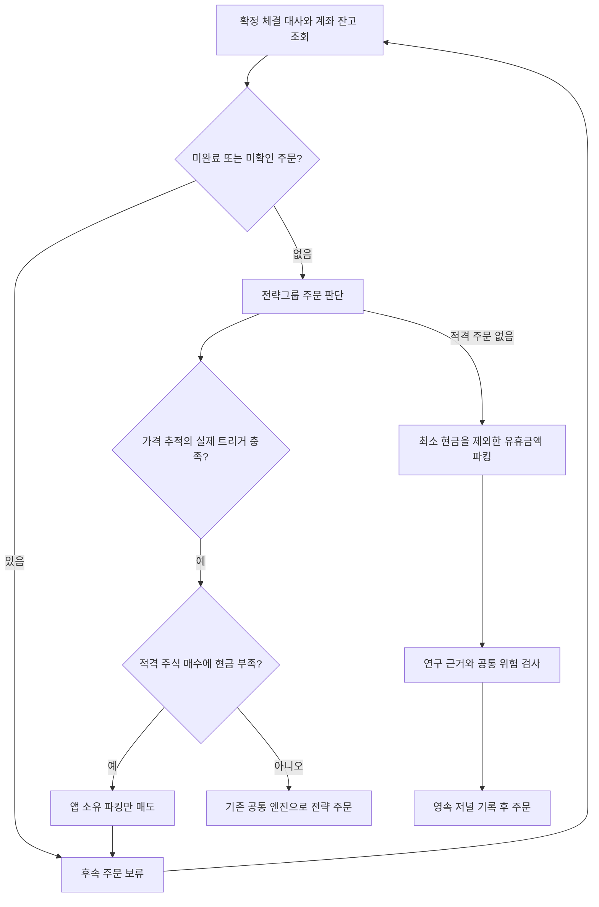

# 유휴 현금과 파킹종목

기준일: 2026-09-20. 사용자가 지정한 종목으로 유휴 현금을 운용하는 기능입니다. 특정 종목 추천, 현금 등가성 또는 수익 보장을 의미하지 않습니다. 사용자 소유 sinpie/NamuMagic 기준 코드와 자금 조정 순서를 확인했습니다. 독립 Kotlin 구현과 원본 차이는 [가격 추적](PRICE_TRACKING.md)에 기록합니다.

## UI와 설정

전략 화면 상단의 **현금 파킹 → 파킹 설정**에서 켜기/끄기, 6자리 종목코드, 최소 현금, 최대 파킹 평가금액, 1회 주문 한도, 하루 매수+매도 한도, 최소 주문금액, 주문 간격을 편집합니다. 기본은 꺼짐/종목 미지정입니다. 기본 금액은 최소 현금 5만원, 최대 파킹 100만원, 1회 10만원, 하루 회전 30만원, 최소 주문 1만원, 간격 300초입니다. 이는 설정 시작값이며 투자 권고가 아닙니다.

설정은 정지 상태에서만 저장하며 계좌를 다시 연결해야 구독에 반영됩니다. 저장 전에는 초안만 변경됩니다. 입력 오류는 저장 버튼을 잠급니다. 거래 기록이 있는 파킹종목은 소유권 보존을 위해 변경할 수 없습니다. 끄기는 자동운용 중단이며 기존 수량 강제 매도가 아닙니다. 초기 버전은 파킹종목 하나이며 전략그룹과 같은 종목으로 지정하지 못합니다. 일반 전략그룹끼리 같은 종목을 갖는 기능은 그대로입니다.

설정은 앱 공통이며 현재 선택된 계좌에 적용합니다. 실제 주문·보유·회차 원장은 증권사/계좌/환경별로 분리합니다. 계좌별로 다른 파킹 설정을 동시에 저장하는 UI는 포함하지 않습니다.

## 실행 순서

전략 매수금액은 전략 수량, 그룹 현금/주문/하루 한도, 계좌 주문/하루 한도 중 작은 범위로 계산합니다. 최소 현금을 제외한 실제 계좌 현금이 부족하면 파킹 매도만 제안하고 원래 주식 주문은 전송하지 않습니다. 매도는 앱이 확정 체결로 산 파킹 수량과 증권사 매도가능 수량 안에서 수행합니다. 외부 수동 보유분은 파킹 소유량으로 인수하지 않습니다.

매도 접수는 자금 확보가 아닙니다. 계좌의 그룹/파킹 주문이 모두 종료 대사된 다음 회차에서 계좌 현금과 원래 전략 조건을 다시 확인합니다. 전략 조건이 사라지면 원래 매수는 실행하지 않습니다. 미체결 부분이나 매도 예상금액을 현금에 더하지 않습니다. 결제일 현금과 주문가능 금액 차이는 실제 증권사 API/계좌 검증 대상이며, 최종 `Broker.available`을 반드시 통과합니다. 자금이 충분해질 때까지 원래 매수를 자동 예약/강제 실행하지 않습니다.

전략 주문이 없으면 실제 계좌 현금에서 최소 현금을 빼고 파킹 평가 상한과 주문/회전 한도 내에서 파킹을 매수합니다. 최소 현금은 모든 전략 매수에도 적용합니다. 1% 비용 여유와 정수 주 단위 때문에 현금이 정확히 목표값에 맞지는 않습니다. 최소 주문금액과 주문 간격으로 작은 차액을 반복 매매하지 않습니다. 가격 상승으로 평가금액이 상한을 넘었다고 강제 매도하지는 않습니다.

## 계층과 클래스

| 클래스/함수 | 역할 |
|---|---|
| `ParkingPolicy` | 설정 유효성, 예약 전략/그룹 ID, 원장용 소유권 |
| `StrategyBook.ledgerGroups` | 일반그룹과 파킹을 함께 소유권 대사에 포함 |
| `ParkingPlanner.decide` | 현금 부족 시 매도/유휴 시 매수 수량을 계산하는 순수 함수 |
| `ParkingPlanner.remaining` | 서울 날짜 기준 파킹 매수+매도 주문금액 한도 |
| `GroupTradingCoordinator.parkingOrder` | 데이터 근거·원장·공통 한도를 확인해 엔진으로 전달 |
| `TradingEngine.submit` | 호가/시간/손실/가능수량/사전 저널/불명확 결과 정지 |
| `GroupLedger` | 별도 파킹 수량·원가·실현손익, 누적 부분체결 중복 방지 |
| `GroupCodec` | 기존 암호화 groupbook에 파킹 설정 직렬화; 이전 파일은 꺼짐으로 이전 |
| `ParkingSettingsCard`, `ParkingEditor` | 현재 설정/확정 보유 표시, 독립 편집 화면 |

파킹 그룹은 `__cash_parking__`, 정책은 `__cash_management__`를 예약합니다. 사용자 전략 자본과 이중 합산하지 않습니다. 파킹은 유휴 현금의 실물 형태를 바꾸는 계좌 공통 정책이며 별도 그룹 자본을 가산하지 않습니다. 파킹의 매도손익은 원장에 기록되지만 각 전략그룹의 배정 자본을 자동 증액하지 않습니다.

일반 전략의 하루 동일 종목·방향 제한은 유지합니다. 파킹은 자금 순환이 필요하므로 영속 저널의 파킹 회차 번호로 중복을 막으며, 이전 주문 종료 확인·주문 간격·하루 매수+매도 한도를 추가 적용합니다. 파킹 매수는 계좌 공통 일 매수 한도와 보유종목 한도도 소비합니다. 회전 한도는 체결금액 대신 예약 주문금액으로 보수적으로 계산하며 부분체결/미체결 종료도 원래 예약금액을 반환하지 않습니다.

## 현재 운영 제한

- 원본에 주문번호 대응 검토 자료가 있으나 앱 어댑터와 모의계좌 대사 검증이 없어 자동주문 시작 잠금은 유지됩니다. 실제 파킹 주문은 실행하지 않았습니다.
- 파킹 매수도 수정주가·재무·공시·뉴스의 필수 자료 게이트를 적용합니다. ETF 등 해당 자료를 제공하지 못하는 상품을 입력해도 자동으로 예외 처리하지 않습니다. 상품별 적격성/데이터 계약은 추가 구현이 필요합니다.
- 공통 자동매도 동의가 있어야 실행할 수 있습니다. 파킹 전용 세금 모델·T+2 결제 모델·종목 교체/기존 수동 보유 편입은 미구현입니다.
- 실제 타겟 추적 후 자금 조정을 수행합니다. 파킹 자체는 반전 추적을 생략하지만 신선한 호가·IOC·소유권·한도 검사는 유지합니다.
- 장중 서비스 세션 안에서만 동작합니다. 시세 장애는 신선한 REST로 복귀하며, 계좌 조회/잔고/원장 오류와 미확인 주문은 안전 정지합니다. 주문을 자동 재전송하지 않습니다.
