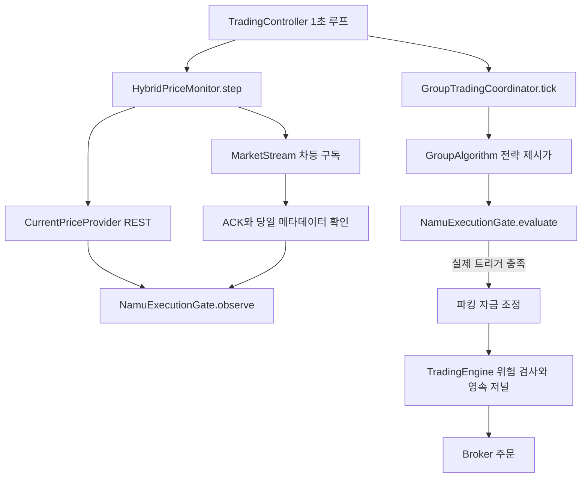

# NamuMagic 기반 가격 추적

기준일 2026-09-20. 사용자 소유 [sinpie/NamuMagic](https://github.com/sinpie/NamuMagic)의 `60e3cf644e92eebe53d85e109622c8f0b1abd727`, `NamuMagic_tracking_policy.py`, `NamuMagic_tracking.py`, `docs/agent/HYBRID_PRICE_TRACKING.md`를 확인했다. 비공개 소스·설정·인증정보는 복사하지 않고 수식을 Kotlin으로 독립 구현했다. 원본 전체와 동일한 동작을 의미하지 않는다.

## 클래스와 함수 흐름

| 클래스 / 함수 | 책임 |
|---|---|
| `TargetRequest` | 그룹·종목·방향·회차·거래일 키, 전략 제시가, 최초 마감 |
| `MarketRules`, `PriceSnapshot` | 당일 상하한·상품 종류, 호가, REST/WS 출처 |
| `CurrentPriceProvider.current` | 주문 Broker와 독립적인 현재가 포트 |
| `NhCurrentPriceProvider.parse` | 공식 currentPrice 시각·양방향 호가·상하한 검증. 누락값 추정 금지 |
| `ExecutionGate` | observe/evaluate/retain/clear/targets 교체 계약 |
| `NamuExecutionGate` | 키별 최초 마감·저점/고점·트리거. 동일 종목도 그룹/방향별 독립 |
| `KrxTicks` | 주식/ETF 호가단위와 가격 구간 경계 틱 이동 |
| `HybridQuotePolicy` | 공유 전송 선택·조회 예정 시각·속도·백오프, 단조 시계 |
| `HybridPriceMonitor` | REST 및 ACK 확인된 WS를 추적계층으로 전달. 주문 재전송 없음 |
| `NhSocket` | 운영 oc 채널, 차등 등록/해제, generation 차단, header ACK와 body 키 배열 검사 |
| `TradingController` | Main scope 직렬 상태. 잔고/체결 약 15초, 추적·전략 약 1초; 네트워크 시간만큼 지연 가능 |

감시 합집합은 앱 한도 100개, 동시 WS는 앱 한도 10개다. 공식 최대 한도가 아니다. 용량 밖 근접 종목은 REST로 검증한다. 전략 계획에는 300초 이내 가격을 사용하지만 실제 트리거와 주문은 각각 15초 이내 호가를 요구한다.

## 전송 선택

거리(%) = `abs(실제 트리거 − 현재 체결가) / 현재 체결가 * 100`. 트리거가 없으면 전략 제시가를 쓴다. 동일 종목의 유효 타겟 중 최소 거리를 공유 구독에 사용한다. 정확히 10%는 WS 대상이다. 이전 문서의 타겟 분모 계획을 원본에 맞춰 수정했다.

REST 기본 간격은 거리 1/3/10/15/20/30% 이하에서 2/3/5/15/30/60초, 초과 180초다. 타겟 전 발견용 조회는 15초다. 체결가 변동 속도·타겟 접근 속도·이전 속도의 0.75 감쇠값 중 최대를 쓴다. 10% 경계 또는 타겟 도달 예상 시간의 절반으로 간격을 줄이되 최소 2초다.

한 step에 REST 한 건, 승인 간격 최소 0.5초, 오래 기다린 종목 우선이다. 실패 시 5/10/20/40/80/120초로 후퇴한다. 동일 캐시는 기한을 밀지 않고 이전 수신시각 샘플은 거리/극값을 되돌리지 않는다. 유효 WS가 계속 오면 REST 기한을 갱신하며 중단되면 REST로 복귀한다. 연결 재시도는 30초부터 최대 300초, 세션 초기화 API는 사용하지 않는다.

당일 가격제한 밖 타겟만 남으면 조회를 중단하고 타겟/거래일 변경 시 재평가한다. 서울 평일 09:05–15:15 밖에는 가격 조회/구독을 중단한다. 공휴일 달력은 미구현이며 거래소 시각·정규장·신선도도 검사한다.

## 실제 트리거

매수는 매도호가가 제시가 이하일 때 저점, 매도는 매수호가가 제시가 이상일 때 고점을 추적한다. 최초 극값은 제시가다. 얕은 구간은 legacy 식: 매수 `min((저점 + 제시가 위 10틱)/2, 저점*1.1)`, 매도 `max((고점 + 제시가 아래 10틱)/2, 고점*0.9)`.

물타기 희망 매수가는 최소 1원이며 0원 나눗셈을 만들지 않는다. 원거리 타겟 등록의 그룹 예산 검사는 제시가 기준으로 하고, 트리거 이후 실제 주문 수량은 최신 호가로 다시 제한한다.

제시가 대비 5% 이상 유리하면 hybrid callback을 적용한다. 경계는 매수 제시가 아래 1틱/매도 위 1틱. callback은 극값의 4%와 경계 초과분 50% 중 큰 값, 최대 극값의 10%다. 호가단위 내림 후 경계로 제한한다. 매수는 legacy보다 낮추지 않는다. 매수는 **매도호가 > 트리거**, 매도는 **매수호가 < 트리거**의 엄격한 반전을 요구한다. 제시가보다 불리하면 만료 시에도 차단한다.

이 앱의 마감은 최초 등록부터 30분 또는 15:14:30 중 이른 시각이며 반복 평가로 연장하지 않는다. 제시가/방향 변경 시 극값과 마감을 새로 등록한다. 리밸런싱·추천·정기매수처럼 명시 제시가가 없으면 최초 호가를 제시가로 고정한다. 매 회차 원래 전략과 데이터 조건을 재검사한다. 조건이 사라진 가상 타겟은 같은 날 표시/감시에 남을 수 있지만 해당 전략 결정 없이는 실행하지 않는다.

파킹 자체는 반전 추적을 우회하되 공통 위험 검사를 통과한다. 주식의 실제 매수 트리거가 충족된 뒤 현금 부족 시에만 파킹을 매도하고 종료 체결·잔고 재조회를 기다린다. 가상 타겟 대기 중 유휴 현금은 파킹 가능하다.

## 공식 자료와 차이·제한

- [NHPlug API](https://www.nhplug.com/apiservice): currentPrice는 live 전용 읽기 경로, 시세 WS는 운영 7070. 주문/계좌는 모의 호스트 유지. 누락 호가·미확인 상품·경매 등 미확인 상태는 추적 주문 차단.
- [KRX 주식 호가단위](https://global.krx.co.kr/contents/GLB/06/0602/0602010201/GLB0602010201T3.jsp), [KRX ETF 규정](https://regulation.krx.co.kr/contents/RGL/03/03060101/RGL03060101.jsp). ETF는 2천원 미만 1원/이상 5원. 상품 종류 문자열은 실제 NH 응답 검증이 더 필요하다.
- 타겟 극값은 메모리 전용이다. 원본의 영속 복구와 달리 정지·계좌 변경·프로세스 종료 시 폐기한다. 실제 주문 저널은 암호화 영속 저장하며 미확인 주문 재시도 금지는 유지한다.
- 원본에서 주문번호 대응 검토 자료를 찾았지만 앱의 `GroupExecutionSource` 어댑터와 모의계좌 대사는 미검증이다. 시작 잠금과 뉴스·수정주가 필수 게이트는 유지한다.
- 시세·분석 탭에서 그룹/제시가/극값/트리거/전송 모드를 표시한다. 테스트의 합성 가격은 사용자 시세에 주입하지 않는다. [검증 결과](VERIFICATION.md).

2026-09-20 검토 보완: 체결가뿐 아니라 bid/ask도 당일 상하한 안에 있어야 합니다. 수신 시각이 최신이어도 거래소 시각이 이전이면 상태를 되돌리지 않습니다. 정지 중 명시적인 종목별 수동 조회는 같은 검증 경로를 사용합니다.
